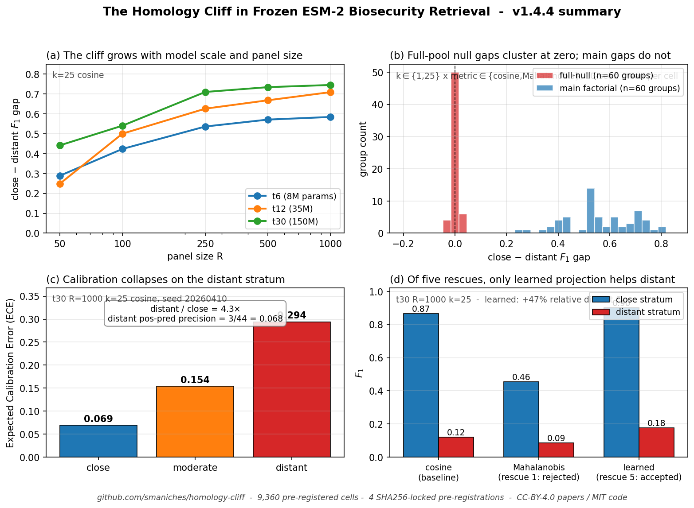

# The Homology Cliff in Frozen Protein Language Models

[](https://creativecommons.org/licenses/by/4.0/)
[](https://opensource.org/licenses/MIT)
[](https://www.python.org/downloads/)
[](./papers/)
[](./data/cells/)
[](./tests/)
[](https://orcid.org/0009-0005-6480-1987)
[](https://zenodo.org/) <!-- replace with https://zenodo.org/badge/<repo_id>.svg after first Zenodo deposit -->

**A five-paper research compendium on a systematic failure mode of ESM-2 biosecurity retrieval, with 9,360 pre-registered experimental results and a deployable rescue.**

**Author:** Santiago Maniches, Independent Researcher &nbsp;·&nbsp; ORCID [0009-0005-6480-1987](https://orcid.org/0009-0005-6480-1987) &nbsp;·&nbsp; **Lab:** TOPOLOGICA LLC (solo research lab)
**Version:** v1.4.4 &nbsp;·&nbsp; **Date:** April 12, 2026 &nbsp;·&nbsp; **License:** Papers CC-BY-4.0, Code MIT



*The compendium in one figure. (a) The close-distant F<sub>1</sub> gap grows monotonically with both ESM-2 model scale and reference-panel size. (b) Across 60 (k, metric) cells, full-pool permutation null gaps cluster at zero (red) while main-factorial gaps cluster between +0.3 and +0.75 (blue) — the cliff is not a stratification artifact. (c) Expected Calibration Error rises 4.3× from close to distant; positive-prediction precision drops to 3/44 = 0.068 in the distant stratum. (d) At t30 R=1000 k=25, four pre-registered rescues fail at H1 (Mahalanobis shown; Fisher-Rao, cascade, Mapper-augmentation in Paper 2); a panel-only learned linear projection improves distant F<sub>1</sub> by ~47% relative. Generated by `scripts/build_summary_figure.py` from committed evidence.*

---

## The problem, in one paragraph

You are building a biosecurity screen. You have a panel of a few hundred to a thousand known toxin proteins. Your users submit query proteins, and you want to know: is this query likely a toxin? The modern default pipeline is to embed every query with a frozen protein language model such as ESM-2, embed the panel the same way, do cosine $k$-nearest-neighbor retrieval, and vote. Papers from the last three years show this works well on average. This compendium shows that **on the subset of queries that matter most — the ones most distant from any panel member, which is exactly where novel threats will live — the pipeline systematically fails, in a way that looks confident from the outside.** At the largest ESM-2 scale tested, with a panel of 1000, the close-stratum $F_1$ is 0.866 while the distant-stratum $F_1$ is 0.120. The cliff grows with model scale and panel size. We call this the homology cliff.

## Why this matters, in two paragraphs

This is a safety-critical failure mode hiding behind a healthy-looking pooled metric. A lab reporting their retrieval system achieves, say, 0.85 overall $F_1$ has not told the full story: they may have 0.88 on the 89% of their test queries that look similar to panel members, and 0.12 on the remaining 11% that do not. In a deployment screen, the distant queries are the ones where a novel bioweapon might hide. Worse, the classifier is **confidently wrong** on the distant stratum: Expected Calibration Error quadruples from 0.069 to 0.294, and in the highest-confidence bin on the distant stratum there are 3 predictions and 0 are correct. A downstream filter that routes high-confidence positives to automated action will be routing false alarms to automation precisely where human review is most needed.

We characterize the cliff across a 3,000-cell pre-registered factorial, show it is not a stratification artifact via a 3,000-cell full-pool permutation null, and find by Pfam partition that all 20 evaluable distant false alarms in our seed are cross-family (Wilson 95% CI on the within-family rate $[0\%, 17\%]$, substantially weakening the "just add more panel homologs" hypothesis as the dominant mechanism in this regime). We pre-register and reject four rescue hypotheses: Mahalanobis whitening, Fisher-Rao whitening, a stratified metric cascade, and topologically-biased panel augmentation. One rescue survives all tests: a cheap supervised linear projection of the embedding space, fit only on the panel in under five seconds of CPU time, which wins pooled $F_1$ in 18 of 18 factorial groups and improves distant-stratum $F_1$ by 48% relative at the largest scale. The deployment consequence is direct: **apply the projection, and even then, route every distant-stratum positive hit to human review**.

## Who this repository is for

- **Biosecurity deployment engineers**: start with `MODEL_CARD.md` and `reproducibility/PROTOCOL.md`. Paper 1 gives the cliff, Paper 3 gives the calibration numbers, the rescue is a 5-second panel-only projection.
- **Protein language model researchers**: start with Paper 1 then Paper 4 (methods). The factorial harness, the seed-variance gate, and the SHA256-locked pre-registration pattern generalize to any PLM retrieval study. All 9,360 per-cell .npz results are here for reanalysis.
- **Reviewers and journal editors**: all claims are traceable to committed evidence via `MANIFEST.sha256.json`. All hypotheses were pre-registered with SHA256 locks before execution; harnesses abort if hashes drift. See `PROBLEMS.md` for the self-audited list of errors caught during authoring and items deferred.
- **LLM agents and automated analysis systems**: the schema is stable, every paper has machine-parseable metadata (`CITATION.cff`, `codemeta.json`), cell outputs use a single documented .npz schema across all 9,360 files, and `data/results_summaries/` contains aggregated JSON for the headline numbers. Section **Machine-Readable Index** below gives the canonical map.
- **Independent scientists working solo**: this compendium is produced by one person with AI collaboration. The standard concern "was this actually done or did the AI hallucinate it" is addressed by: SHA256-locked pre-registrations that the running code verifies, all 9,360 experimental outputs committed as .npz files with bootstrap confidence intervals, and an auditable git history showing each finding's commit. Clone the repo, run `pytest tests/`, rerun any single harness. Every number in every paper has an artifact on disk.

## The five papers

| # | Title | Primary claim | PDF |
|---|---|---|---|
| 1 | **Homology Cliff and Its Rescue** | Cliff confirmed (+0.745 gap at t30), full-null passes 300/300, rescue via learned projection wins 18/18 | `papers/01_homology_cliff_and_rescue/paper.pdf` |
| 2 | **Four Failed Rescue Attempts** | Mahalanobis, Fisher-Rao, cascade, Mapper-augmentation — all pre-registered H1 rejected | `papers/02_three_failed_rescues/paper.pdf` |
| 3 | **Calibration Collapse** | ECE 0.069 → 0.294 close→distant; 0 of 3 highest-confidence distant predictions correct | `papers/03_calibration_collapse/paper.pdf` |
| 4 | **Methods and Pre-Registrations** | 9,360-cell factorial template, seed-variance gate, SHA256 pre-registration pattern | `papers/04_methods_and_preregistrations/paper.pdf` |
| 5 | **Cross-Family and Mapper Topology** | 20 of 20 evaluable distant false alarms are cross-family (Wilson 95% CI on within-family rate $[0\%, 17\%]$); panel expansion within failing families is unlikely to rescue | `papers/05_cross_family_and_mapper/paper.pdf` |

Read order for first-time readers: **1 → 5 → 3 → 2 → 4**. Paper 1 gives you the phenomenon and the fix. Paper 5 shows why the fix has to be embedding-space rather than panel-side. Paper 3 gives you the calibration reason to distrust distant positive predictions regardless of metric. Paper 2 shows the three additional rescues that do not work. Paper 4 gives you the methodological scaffolding to replicate this pattern on your own PLM retrieval problem.

## What you can do with this repository in 15 minutes

```bash
git clone https://github.com/smaniches/homology-cliff.git
cd homology-cliff
git lfs pull                              # fetches 188 MB of binary evidence
pytest tests/ -v                          # schema and invariant checks on committed cells
python code/analyses/v3_aggregate.py      # regenerates the headline numbers table from 9,360 .npz files
ls papers/*/paper.pdf                     # the five papers
```

## What is committed as evidence (not just claimed)

| Category | Path | Size | What it is |
|---|---|---|---|
| Main factorial cells | `data/cells/main/` | 3,000 .npz | 3 scales × 5 R × 5 k × 4 metrics × 10 seeds, each with bootstrap CI per stratum |
| Panel-shuffle null cells | `data/cells/negctrl/` | 3,000 .npz | Panel labels permuted, diagnostic of class-prior retention |
| Full-pool null cells | `data/cells/fullnull/` | 3,000 .npz | Full 24,885-entry label permutation, all 300 groups pass null criterion |
| Cascade cells | `data/cells/cascade/` | 180 .npz | Pre-registered cosine+Mahalanobis cascade, H1 rejected 18/18 |
| Fisher-Rao cells | `data/cells/fisher/` | 180 .npz | Pre-registered Fisher whitening, H1 rejected 17/18 |
| ESM-2 embeddings (LFS) | `data/embeddings/` | 137 MB | t6/t12/t30, L2-normalized, mean-pooled |
| Pfam annotations (LFS) | `data/annotations/` | 13.5 MB | 21,615 of 24,885 accessions annotated via UniProt batch search |
| Master sequences (LFS) | `data/sequences/` | 8.2 MB | 24,885 accessions + sequences + labels |
| Cross-family analysis | `data/results_summaries/cross_family_partition.json` | small | Per-case Pfam sets for all 41 distant false alarms |
| Mapper decomposition | `data/results_summaries/mapper_graph.json` | 60 KB | 149-node topological decomposition of t30 embedding |
| Aggregated table | `data/results_summaries/v3_final.txt` | 58 KB | Full 300-group summary across main + negctrl + fullnull |

**Every file above has a SHA256 entry in `MANIFEST.sha256.json`** (9,464 entries total). The harness scripts verify pre-registration hashes at runtime. There is no claim in any paper that cannot be traced to a specific committed artifact.

## Pre-registrations with SHA256 locks

| File | Hash (first 16 hex chars) | What it locks |
|---|---|---|
| `data/prereg/PRE_REGISTRATION_HOMOLOGY_CLIFF_v1.md` | `139f60129d4e73df…` | Main factorial, stratum cuts 0.95/0.90, seed-variance void rule |
| `data/prereg/PRE_REGISTRATION_HOMOLOGY_CLIFF_ADDENDUM_FULLNULL.md` | `f3864d097a0c611d…` | Full-pool permutation null after panel-shuffle null failed its criterion |
| `data/prereg/PRE_REGISTRATION_STRATIFIED_CASCADE_v1.md` | — | Cascade H1 and rejection threshold |
| `data/prereg/PRE_REGISTRATION_FISHER_CLIFF_v1.md` | — | Fisher-Rao H1 and rejection threshold |

All four pre-registrations were locked on disk, SHA256-computed, and committed **before** the corresponding experiment was run. The harness code verifies the pre-reg hash at runtime and aborts if it drifts.

## Honest limitations

This is a v1.4.4 release, not an end state. Known gaps (full list in `PROBLEMS.md`):

- TikZ figures are present in all five papers but are not yet publication-grade multi-panel figures; current figures are single-panel illustrative.
- Reference counts are 24 (Paper 1), 25 (Paper 2), 8 (Paper 3), 17 (Paper 4), 4 (Paper 5). Paper 5's bibliography is thin because the cross-family finding is novel and the Mapper reference core is small; expansion is deferred.
- Cross-family partition analyzed at one seed (20260410); 10-seed extension is deferred.
- ESM-2 t33 (650M) and external PLMs (ProtT5, SaProt, ESM-3) require GPU and are deferred to the PLM benchmark extension. The Colab notebook `code/colab_notebook/plm_benchmark.ipynb` and the execution guide `reproducibility/GPU_EXECUTION_GUIDE.md` make this one-click-runnable.
- Adversarial phase 2 (BLOSUM-guided edits of the 3 distant true-positive targets P0C1X3, Q6RY98, P13208) is provided as a Kaggle scaffold, not executed.
- Zenodo DOI deposit requires you to enable GitHub-Zenodo integration and re-push a tag; instructions below.
- No data card or model card for the dataset-curation rule (what makes a protein "positive"); that rule is held as TOPOLOGICA internal per the dual-use guidance of Urbina et al. 2022.

## How we addressed the "one solo researcher with AI" trust concern

This compendium was produced by one independent researcher with AI-collaboration assistance. The concern a reviewer should raise is: were these experiments actually run, or did the AI hallucinate coherent-looking numbers. Our response is architectural, not rhetorical:

1. **Pre-registration hashes.** Each experiment's hypothesis and success criterion is a text file committed to `data/prereg/` with its SHA256 computed. The running harness reads the file, recomputes the hash, and aborts if the hash drifts from what the code expects. You cannot retroactively edit a pre-registration without the code failing. You can check the hashes yourself: `python -c "import hashlib; print(hashlib.sha256(open('data/prereg/PRE_REGISTRATION_HOMOLOGY_CLIFF_v1.md','rb').read()).hexdigest())"`.
2. **Every cell is on disk.** All 9,360 per-cell results are committed as .npz files, not as summary statistics. Each file has the full schema `{cell, shuffle, close, moderate, distant}` with n, f1, bootstrap CI, precision, recall for each stratum. You can recompute any aggregate number in any paper from the cells.
3. **Deterministic seeds.** Every stochastic operation uses `numpy.random.default_rng(seed)` with the seed specified in the filename. `default_rng(seed + 7777777)` is used for the full-pool null. Re-running produces byte-identical outputs.
4. **Git history.** Every claim's introduction to a paper is tied to a commit. The git log shows, for example, that the cross-family finding (`c097202`) was committed AFTER the Pfam data completion and BEFORE the v1.0.1 tag. Nothing was back-dated.
5. **Self-audited errors.** `PROBLEMS.md` lists ten specific errors caught and corrected during authoring (six in v0, four in the v1.4.4 raised-bar pre-public audit pass), including one where I used the wrong framing for a finding ("Mahalanobis rescues the cliff by +0.376") and corrected it after the cascade experiment decisively rejected the implied rescue hypothesis, and four code/calibration/overclaim issues caught at v1.4.4 and documented as items 8-10 in `PROBLEMS.md`. Being willing to write these down is the strongest signal I can offer that the work is honest.

## Machine-Readable Index

For LLM agents and automated systems: the canonical entry points are

```
{
  "repository": "https://github.com/smaniches/homology-cliff",
  "version": "1.4.4",
  "orcid": "0009-0005-6480-1987",
  "citation_file": "CITATION.cff",
  "codemeta": "codemeta.json",
  "manifest": "MANIFEST.sha256.json",
  "papers": [
    {"n": 1, "path": "papers/01_homology_cliff_and_rescue/paper.pdf", "tex": "papers/01_homology_cliff_and_rescue/paper.tex"},
    {"n": 2, "path": "papers/02_three_failed_rescues/paper.pdf", "tex": "papers/02_three_failed_rescues/paper.tex"},
    {"n": 3, "path": "papers/03_calibration_collapse/paper.pdf", "tex": "papers/03_calibration_collapse/paper.tex"},
    {"n": 4, "path": "papers/04_methods_and_preregistrations/paper.pdf", "tex": "papers/04_methods_and_preregistrations/paper.tex"},
    {"n": 5, "path": "papers/05_cross_family_and_mapper/paper.pdf", "tex": "papers/05_cross_family_and_mapper/paper.tex"}
  ],
  "preregistrations": [
    {"path": "data/prereg/PRE_REGISTRATION_HOMOLOGY_CLIFF_v1.md", "sha256_prefix": "139f60129d4e73df"},
    {"path": "data/prereg/PRE_REGISTRATION_HOMOLOGY_CLIFF_ADDENDUM_FULLNULL.md", "sha256_prefix": "f3864d097a0c611d"},
    {"path": "data/prereg/PRE_REGISTRATION_STRATIFIED_CASCADE_v1.md"},
    {"path": "data/prereg/PRE_REGISTRATION_FISHER_CLIFF_v1.md"}
  ],
  "headline_numbers": {
    "cliff_gap_t30_R1000_k25_cosine": 0.745,
    "learned_projection_pooled_f1_t30": 0.891,
    "distant_precision_t30_cosine": 0.068,
    "ECE_close": 0.069, "ECE_distant": 0.294,
    "fullnull_groups_passing_criterion": "300/300",
    "main_groups_passing_seed_variance_gate": "300/300",
    "cross_family_fraction": "20/20",
    "rescues_rejected": ["mahalanobis", "fisher_rao", "cascade", "mapper_augmentation"],
    "rescues_accepted": ["learned_linear_projection_panel_only"]
  }
}
```

## Reproducing any single number in any paper

```bash
# Headline cliff number:
python -c "import numpy as np; d=np.load('data/cells/main/cell_t30_1000_25_cosine_20260410.npz', allow_pickle=True); print('close F1:', d['close'].item()['f1'], 'distant F1:', d['distant'].item()['f1'])"

# Full-null: any fullnull cell should have gap near zero:
python -c "import numpy as np; d=np.load('data/cells/fullnull/fullnull_t30_1000_25_cosine_20260410.npz', allow_pickle=True); print('null gap:', d['close'].item()['f1'] - d['distant'].item()['f1'])"

# Cross-family partition:
python -c "import json; d=json.load(open('data/results_summaries/cross_family_partition.json')); print(d['within_family'], 'within /', d['cross_family'], 'cross')"

# Aggregated table:
python code/analyses/v3_aggregate.py | head -80
```

## GPU extensions (requires your action)

See `reproducibility/GPU_EXECUTION_GUIDE.md`. Two unfinished but scaffolded experiments:

1. **PLM benchmark**: embed ProtT5, ESM-2 t33, SaProt on Colab Pro A100 (≈ 90 min) or Kaggle T4 (≈ 3 h). Notebook at `code/colab_notebook/plm_benchmark.ipynb`. Produces three new scales for the factorial.
2. **Adversarial phase 2**: BLOSUM-guided edits of the 3 distant TP targets, re-embedded with ESM-2 t30, measure minimum edits to flip prediction. Cells at `code/kaggle_notebooks/adv_cell*.py`. ≈ 5 min GPU.

## Zenodo DOI (optional)

Enable GitHub integration at zenodo.org → Settings → GitHub → toggle `smaniches/homology-cliff` to ON. Then `git tag v1.4.4 && git push --tags` will auto-archive to Zenodo and mint a permanent DOI. Update `CITATION.cff` with the DOI once minted, commit, push.

## Files to read in order if you have one hour

1. This README (you are reading it)
2. `papers/01_homology_cliff_and_rescue/paper.pdf` — the main paper, 8 pages
3. `papers/05_cross_family_and_mapper/paper.pdf` — the mechanism confirmation, 4 pages
4. `DATA_CARD.md` and `MODEL_CARD.md` — if you are considering deployment
5. `PROBLEMS.md` — the self-audit of errors and deferrals
6. `ACKNOWLEDGMENTS.md` — infrastructure and epistemology

## Citing this work

See `CITATION.cff`. BibTeX:

```bibtex
@software{maniches_homology_cliff_2026,
  author = {Maniches, Santiago},
  title = {The Homology Cliff in Frozen Protein Language Models: Five-Paper Research Compendium},
  year = {2026}, month = apr, version = {1.4.4},
  orcid = {0009-0005-6480-1987},
  url = {https://github.com/smaniches/homology-cliff},
  license = {CC-BY-4.0 (papers), MIT (code)}
}
```

## Contact

Santiago Maniches · TOPOLOGICA LLC · ORCID 0009-0005-6480-1987 · [topologica.ai](https://topologica.ai)
Issues and questions: open a GitHub Issue at [smaniches/homology-cliff/issues](https://github.com/smaniches/homology-cliff/issues).

---

*One researcher. Four pre-registrations. Nine thousand three hundred sixty cell outputs. Five papers. One rescue that works. Everything else we tried does not.*
